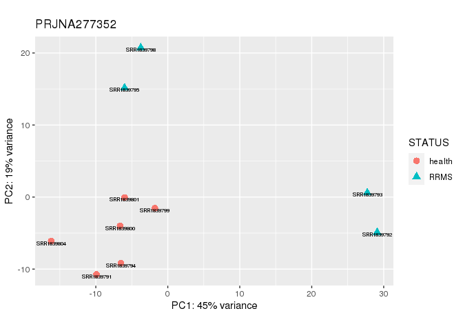

DESeq2 PRJNA277352 & PRJNA521868
================
YOUR NAME - R version 4.0.5 (2021-03-31)
2021-10-19

Clean work environment and set source file.

``` r
rm(list = ls())
gc()
```

    ##          used (Mb) gc trigger (Mb) max used (Mb)
    ## Ncells 409125 21.9     841725   45   654405 35.0
    ## Vcells 769628  5.9    8388608   64  1771129 13.6

``` r
SOURCE="../../../github/PEXPID/bin/functions.R"
```

Import all counts.

``` r
source(SOURCE)

FILE = "../../../result/count_table_535_samples_16-09-2021.tab"

cts_all = IMPORT_CTS(FILE)
head(cts_all)
```

    ##                 SRR10397568 SRR10397569 SRR10397570 SRR10397571 SRR10397572
    ## ENSG00000000003           6          26          10          14           3
    ## ENSG00000000005           0           1           0           0           0
    ## ENSG00000000419         635         784         650         707         769
    ## ENSG00000000457         429         481         346         518         591
    ## ENSG00000000460         140         146         124         182         155
    ## ENSG00000000938       11777        9806       15273        7164       23457
    ##                 SRR10397573 SRR10397574 SRR10397575 SRR10397576 SRR10397577
    ## ENSG00000000003           6          74          20           5           4
    ## ENSG00000000005           1           0           0           0           0
    ## ENSG00000000419         936        1312         940         371         321
    ## ENSG00000000457         561         796         382          76         141
    ## ENSG00000000460         205         188         107          60          48
    ## ENSG00000000938       12734        9107        7556        3595        8545
    ##                 SRR10397578 SRR10397579 SRR10397580 SRR10397581 SRR10397582
    ## ENSG00000000003          24          19          16          15          21
    ## ENSG00000000005           1           0           0           3           0
    ## ENSG00000000419        1188        1080        1342        1553         890
    ## ENSG00000000457         326         320         546         501         520
    ## ENSG00000000460         125          86         192         192         218
    ## ENSG00000000938        9169        9898       16236        7249       10440
    ##                 SRR10397583 SRR10397584 SRR10397585 SRR10397586 SRR10397587
    ## ENSG00000000003          16          30          17          13           4
    ## ENSG00000000005           0           0           0           0           0
    ## ENSG00000000419        1515        1220         887        1068         949
    ## ENSG00000000457         693         829         615         621         514
    ## ENSG00000000460         287         241         175         215         170
    ## ENSG00000000938       13841       12204       11802       15954        7455
    ##                 SRR10397588 SRR10397589 SRR10397590 SRR10397591 SRR10397592
    ## ENSG00000000003           5           0           5          43          31
    ## ENSG00000000005           0           0           0           0           0
    ## ENSG00000000419         876         316        1559        1011         877
    ## ENSG00000000457         383         159         682         689         611
    ## ENSG00000000460         149          45         251         170         163
    ## ENSG00000000938       11757        2987        9129        7325        7022
    ##                 SRR10397593 SRR10397594 SRR3389246 SRR3390437 SRR3390461
    ## ENSG00000000003          20          19          5          2          4
    ## ENSG00000000005           0           2          0          0          0
    ## ENSG00000000419        1403        1430        352        331        250
    ## ENSG00000000457         627         567        435        318        351
    ## ENSG00000000460         259         201        118         99         95
    ## ENSG00000000938       12506       11860      21108      19257      14236
    ##                 SRR3390462 SRR3390463 SRR3390473 SRR3390758 SRR3390765
    ## ENSG00000000003          7          4          8          2          3
    ## ENSG00000000005          0          0          0          0          0
    ## ENSG00000000419        317        306        254        328        320
    ## ENSG00000000457        408        396        318        371        337
    ## ENSG00000000460         98         95         84        136         98
    ## ENSG00000000938      12183      20347      15515      18454      15919
    ##                 SRR3390780 SRR3391850 SRR3391887 SRR3391946 SRR3392116
    ## ENSG00000000003          4          5         17          5         14
    ## ENSG00000000005          0          0          0          0          0
    ## ENSG00000000419        298        320        355        294        299
    ## ENSG00000000457        317        377        373        311        310
    ## ENSG00000000460        108        132        127         71        104
    ## ENSG00000000938      14658      17618      11824      14978      13401
    ##                 SRR3392598 SRR3392619 SRR3392636 SRR10037631 SRR10037632
    ## ENSG00000000003         11          3          4           5          12
    ## ENSG00000000005          0          0          0           0           0
    ## ENSG00000000419        393        329        257         176         416
    ## ENSG00000000457        458        349        299         681         879
    ## ENSG00000000460        143        104         92         179         316
    ## ENSG00000000938      14911      11242      17004        5829        6212
    ##                 SRR10037633 SRR10037634 SRR10037635 SRR10037636 SRR10037637
    ## ENSG00000000003          15          10           4          11           3
    ## ENSG00000000005           0           0           2           0           0
    ## ENSG00000000419         661         600         626         450         374
    ## ENSG00000000457         956         905         970         944         795
    ## ENSG00000000460         396         352         335         406         260
    ## ENSG00000000938        7895        6837        9157        9311        6975
    ##                 SRR10037638 SRR10037639 SRR10037640 SRR10037641 SRR10037642
    ## ENSG00000000003          11           2          16          16           4
    ## ENSG00000000005           0           0           1           1           0
    ## ENSG00000000419         631          59         622         853         259
    ## ENSG00000000457        1077         170        1294        1318         816
    ## ENSG00000000460         387          63         411         445         327
    ## ENSG00000000938        6285        1645        7885        8476        6157
    ##                 SRR10037656 SRR10037657 SRR10037658 SRR10037659 SRR10037660
    ## ENSG00000000003           9          21           6           0           8
    ## ENSG00000000005           0           0           1           0           0
    ## ENSG00000000419         265         606         219         104         225
    ## ENSG00000000457         551         993         596         247         752
    ## ENSG00000000460         245         333         210          91         231
    ## ENSG00000000938        7474        7308        7207        2415        9795
    ##                 SRR10037661 SRR10037662 SRR10037676 SRR10037677 SRR10037678
    ## ENSG00000000003          10          21          11          36           8
    ## ENSG00000000005           0           0           0           3           0
    ## ENSG00000000419         272         834         305         537         477
    ## ENSG00000000457         614         996         760        1117         936
    ## ENSG00000000460         216         328         265         437         298
    ## ENSG00000000938        5127        8196        8531        6129        3863
    ##                 SRR10037679 SRR10037643 SRR10037644 SRR10037645 SRR10037646
    ## ENSG00000000003           7           2          12          19           3
    ## ENSG00000000005           1           1           0           1           0
    ## ENSG00000000419         377          79         295         668         431
    ## ENSG00000000457         773         209         721        1428        1057
    ## ENSG00000000460         307          83         227         557         354
    ## ENSG00000000938        7338        2336        5352        9730        7870
    ##                 SRR10037647 SRR10037648 SRR10037649 SRR10037663 SRR10037664
    ## ENSG00000000003           4          19          16          25           1
    ## ENSG00000000005           0           1           0           1           1
    ## ENSG00000000419         359         499         405         519         129
    ## ENSG00000000457         824        1088        1046        1480         130
    ## ENSG00000000460         281         402         317         557          57
    ## ENSG00000000938        8647        9761        7939        7909        1814
    ##                 SRR10037665 SRR10037666 SRR10037667 SRR10037668 SRR10037669
    ## ENSG00000000003          12          10          13          14          11
    ## ENSG00000000005           0           0           1           0           0
    ## ENSG00000000419         495         329         394         362         171
    ## ENSG00000000457        1151         665         883        1043         324
    ## ENSG00000000460         381         325         328         319         171
    ## ENSG00000000938        6708        4890        7004       12120        2587
    ##                 SRR10037650 SRR10037651 SRR10037652 SRR10037653 SRR10037654
    ## ENSG00000000003          18          19           3           4           9
    ## ENSG00000000005           1           0           0           0           0
    ## ENSG00000000419         431         453          76         385         762
    ## ENSG00000000457         800        1317         209        1072        1080
    ## ENSG00000000460         310         393          58         331         366
    ## ENSG00000000938        5999        8002        3555       12946       13682
    ##                 SRR10037655 SRR10037670 SRR10037671 SRR10037672 SRR10037673
    ## ENSG00000000003          26           4           6           0           8
    ## ENSG00000000005           0           0           0           0           0
    ## ENSG00000000419         549         330         245          41         450
    ## ENSG00000000457        1166         893         666         127         797
    ## ENSG00000000460         450         307         229          50         259
    ## ENSG00000000938        9167        7217        5461        1872        6095
    ##                 SRR10037674 SRR10037675 SRR13810613 SRR13810614 SRR13810615
    ## ENSG00000000003          17           5           0           4           2
    ## ENSG00000000005           0           0           2           0           0
    ## ENSG00000000419         581         239         121         109         162
    ## ENSG00000000457        1089         441         294         339         393
    ## ENSG00000000460         398         151         100         135         108
    ## ENSG00000000938        4729        2756        7438        4370        5799
    ##                 SRR13810616 SRR13810617 SRR13810618 SRR13810619 SRR13810620
    ## ENSG00000000003           2          13           0           2           8
    ## ENSG00000000005           0           0           0           0           0
    ## ENSG00000000419         258         256         181          77         216
    ## ENSG00000000457         490         596         481         132         586
    ## ENSG00000000460         173         266         198          52         310
    ## ENSG00000000938        3910        6750        8166         940       11424
    ##                 SRR13810638 SRR13810639 SRR13810640 SRR13810641 SRR13810642
    ## ENSG00000000003           9           8          11           5           7
    ## ENSG00000000005           0           0           0           0           0
    ## ENSG00000000419         288         251         203         220         279
    ## ENSG00000000457         884         513         456         467         690
    ## ENSG00000000460         345         258         208         188         267
    ## ENSG00000000938       14368       10824        9399        8283       10019
    ##                 SRR1839791 SRR1839792 SRR1839793 SRR1839794 SRR1839795
    ## ENSG00000000003         21          4          0          4          4
    ## ENSG00000000005          0          0          0          0          0
    ## ENSG00000000419        215         34         55        153        163
    ## ENSG00000000457        421        250         77        418        287
    ## ENSG00000000460         74         19         19         55         39
    ## ENSG00000000938      23163      17974       7083      23084      18988
    ##                 SRR1839796 SRR3724621 SRR3724622 SRR3724623 SRR3724624
    ## ENSG00000000003         10          2         23          3         17
    ## ENSG00000000005          0          0          0          0          4
    ## ENSG00000000419        146        173        411        160        313
    ## ENSG00000000457        428        307        736        292        488
    ## ENSG00000000460         96         94        141        116        183
    ## ENSG00000000938      23366         12         17        797        270
    ##                 SRR3724625 SRR3724626 SRR13810621 SRR13810622 SRR13810623
    ## ENSG00000000003          9         43           2           3           7
    ## ENSG00000000005          0          0           0           0           0
    ## ENSG00000000419        198        316         210         236         131
    ## ENSG00000000457        214        403         612         557         411
    ## ENSG00000000460         35         99         257         259         237
    ## ENSG00000000938        161         49        9367        9238        6347
    ##                 SRR13810624 SRR13810625 SRR13810626 SRR13810627 SRR13810643
    ## ENSG00000000003           1           1           1          17           6
    ## ENSG00000000005           0           0           0           0           0
    ## ENSG00000000419          79          38         131         129         210
    ## ENSG00000000457         247         161         262         262         555
    ## ENSG00000000460         108          53         102         177         254
    ## ENSG00000000938        5747        2286        2350        2142        7607
    ##                 SRR13810644 SRR13810645 SRR13810646 SRR13810647 SRR13810648
    ## ENSG00000000003           4          16           6           5          12
    ## ENSG00000000005           0           0           0           0           2
    ## ENSG00000000419         143         257         317         106         362
    ## ENSG00000000457         361         666         634         283         868
    ## ENSG00000000460         117         243         290         120         335
    ## ENSG00000000938        4169        8630        9920        3776        9931
    ##                 SRR1839797 SRR1839798 SRR1839799 SRR1839800 SRR1839801
    ## ENSG00000000003          2          6          1          5          7
    ## ENSG00000000005          0          0          0          0          0
    ## ENSG00000000419         83         98         38         63         73
    ## ENSG00000000457        204        209        155        259        222
    ## ENSG00000000460         36         39         32         32         60
    ## ENSG00000000938      18228      17525       9862      20696      11884
    ##                 SRR1839802 SRR1839803 SRR3724627 SRR3724628 SRR3724629
    ## ENSG00000000003          5          2          0         11          3
    ## ENSG00000000005          0          0          0          0          1
    ## ENSG00000000419        121         84        232        269        162
    ## ENSG00000000457        276        273        223        267        189
    ## ENSG00000000460         54         42         64         65         35
    ## ENSG00000000938      15231       8036       1894        747        110
    ##                 SRR3724630 SRR3724631 SRR13810628 SRR13810629 SRR13810630
    ## ENSG00000000003         12          8           5          10           9
    ## ENSG00000000005          0          1           0           1           1
    ## ENSG00000000419        119        187         167          68         172
    ## ENSG00000000457         89        185         516         250         510
    ## ENSG00000000460         29         51         290         140         231
    ## ENSG00000000938         15        344        8364        2722        9582
    ##                 SRR13810631 SRR13810632 SRR13810633 SRR13810649 SRR13810650
    ## ENSG00000000003           6           3           5          20           7
    ## ENSG00000000005           0           0           0           1           0
    ## ENSG00000000419         145         135         157         445         100
    ## ENSG00000000457         477         351         452         943         334
    ## ENSG00000000460         202         170         184         441         157
    ## ENSG00000000938        7223        6111        8965        7979        4297
    ##                 SRR13810651 SRR13810652 SRR13810653 SRR1839804 SRR3350013
    ## ENSG00000000003           7           5           0          6          0
    ## ENSG00000000005           0           1           0          0          0
    ## ENSG00000000419         390         153          60        149          8
    ## ENSG00000000457         564         453         185        331         16
    ## ENSG00000000460         246         162          78         85          3
    ## ENSG00000000938        6327        7272        2099      15752        245
    ##                 SRR3350014 SRR3350015 SRR3350016 SRR3350017 SRR3350018
    ## ENSG00000000003          0          0          0          0          0
    ## ENSG00000000005          0          0          0          0          0
    ## ENSG00000000419         20         13          5         73         28
    ## ENSG00000000457          6          4          2         72         52
    ## ENSG00000000460          0          1          0         39         33
    ## ENSG00000000938        550        311        151       3024       2599
    ##                 SRR3350019 SRR3724632 SRR3724633 SRR3724634 SRR3724635
    ## ENSG00000000003          0         26          3          1          2
    ## ENSG00000000005          0          0          0          0          0
    ## ENSG00000000419        141        226        309        265        237
    ## ENSG00000000457         38        227        101         87         50
    ## ENSG00000000460         22         50         24         24         14
    ## ENSG00000000938       5080        285         19         35         89
    ##                 SRR3724636 SRR3724637 SRR13810634 SRR13810635 SRR13810636
    ## ENSG00000000003          0         12           9           1           2
    ## ENSG00000000005          0          0           1           0           0
    ## ENSG00000000419        242        281         222         106         207
    ## ENSG00000000457         88        382         729         219         477
    ## ENSG00000000460         31        117         329         107         234
    ## ENSG00000000938        146         21        8571        2700       10991
    ##                 SRR13810637 SRR13810654 SRR13810655 SRR13810656 SRR13810657
    ## ENSG00000000003           4           7          11           7           3
    ## ENSG00000000005           0           0           0           1           0
    ## ENSG00000000419         118         311         203         155         318
    ## ENSG00000000457         435         707         415         564         684
    ## ENSG00000000460         155         299         173         241         237
    ## ENSG00000000938       10706       14533        5043        6254       18554
    ##                 SRR13810658 SRR13810659 SRR13810660 SRR13810661 SRR13810662
    ## ENSG00000000003          12           3           7          10           8
    ## ENSG00000000005           0           0           0           0           0
    ## ENSG00000000419         322         102         448         264         207
    ## ENSG00000000457         729         251         708         696         565
    ## ENSG00000000460         453          82         200         286         236
    ## ENSG00000000938        4061        4119       11475       11634        8916
    ##                 SRR3724617 SRR3724618 SRR3724619 SRR3724620 SRR3724638
    ## ENSG00000000003         19         22          5         17          0
    ## ENSG00000000005          0          1          0          1          0
    ## ENSG00000000419        250        193        167        198        259
    ## ENSG00000000457        427        345        274        325        386
    ## ENSG00000000460         79         83         87         92        109
    ## ENSG00000000938         81         52        392        280         21
    ##                 SRR3724639 SRR3724640 SRR6652768 SRR6652769 SRR6652770
    ## ENSG00000000003          0          0         31         31         15
    ## ENSG00000000005          0          0          0          0          0
    ## ENSG00000000419        309        229        657        404        442
    ## ENSG00000000457        257        250        562        545        446
    ## ENSG00000000460         74         96        289        121        172
    ## ENSG00000000938        322        656        271        198        757
    ##                 SRR6652771 SRR6652772 SRR13214141 SRR13214142 SRR13214143
    ## ENSG00000000003         17          1           0           0           1
    ## ENSG00000000005          0          0           0           0           0
    ## ENSG00000000419        718        729         378        1083        1301
    ## ENSG00000000457        346        475          72         261         409
    ## ENSG00000000460        114        358         188         141         127
    ## ENSG00000000938       1222         60       12601        7675        5277
    ##                 SRR13214144 SRR13214145 SRR13214146 SRR13214147 SRR13214148
    ## ENSG00000000003           3           1           3           3          21
    ## ENSG00000000005           0           0           0           0           3
    ## ENSG00000000419         855         168        1029         949         897
    ## ENSG00000000457         126          31         455         400         579
    ## ENSG00000000460         181          90         199         179         149
    ## ENSG00000000938        9150       12648        5304        3161        2855
    ##                 SRR13214149 SRR13214150 SRR13810601 SRR13810602 SRR13810603
    ## ENSG00000000003           6          31           3           2           5
    ## ENSG00000000005           1           0           0           0           0
    ## ENSG00000000419        1068         855         291         112         280
    ## ENSG00000000457         485         528         638         354         646
    ## ENSG00000000460         228         196         262         161         232
    ## ENSG00000000938        3709        2984       11656        8371       10867
    ##                 SRR13810604 SRR13810605 SRR13810606 SRR13810607 SRR13810608
    ## ENSG00000000003           8           4           7           9           4
    ## ENSG00000000005           0           0           0           0           0
    ## ENSG00000000419         120         156         132         295         205
    ## ENSG00000000457         288         320         495         559         509
    ## ENSG00000000460         159         130         209         173         202
    ## ENSG00000000938        3335        2722        7824        7054       11841
    ##                 SRR13810609 SRR13810610 SRR13810611 SRR13810612 SRR6652773
    ## ENSG00000000003           1          12           3          19         15
    ## ENSG00000000005           0           0           0           0          0
    ## ENSG00000000419          45         299          95         579        404
    ## ENSG00000000457         140         831         257        1319        426
    ## ENSG00000000460          55         309          98         558        109
    ## ENSG00000000938        1621        6128        2992       21798        129
    ##                 SRR6652774 SRR6652775 SRR6652776 SRR6652777 SRR6652778
    ## ENSG00000000003         11         57         18         33         41
    ## ENSG00000000005          0          0          0          0          0
    ## ENSG00000000419        260        611        418        413        423
    ## ENSG00000000457        513        591        404        338        593
    ## ENSG00000000460        160        158        130        102        158
    ## ENSG00000000938        944         67        166         41         20
    ##                 SRR6652779 SRR6652780 SRR6868550 SRR6868551 SRR6868552
    ## ENSG00000000003         35         12         11          4         10
    ## ENSG00000000005          0          0          0          0          0
    ## ENSG00000000419        656        383        769        256        415
    ## ENSG00000000457        552        279        471        177        255
    ## ENSG00000000460        159        227        112         39         54
    ## ENSG00000000938         53         21      14736       3934       9182
    ##                 SRR6868553 SRR6868554 SRR6868575 SRR6868576 SRR6868577
    ## ENSG00000000003          5         18          7          9         10
    ## ENSG00000000005          0          0          0          0          0
    ## ENSG00000000419        404        570        461        561        415
    ## ENSG00000000457        276        339        238        386        192
    ## ENSG00000000460         51         64         49         68         65
    ## ENSG00000000938      12335       7161       7329      10376      10309
    ##                 SRR6868578 SRR6868579 SRR6868580 SRR6868600 SRR6868601
    ## ENSG00000000003         20          1          9         11          8
    ## ENSG00000000005          0          0          0          0          0
    ## ENSG00000000419        498        356        576        515        544
    ## ENSG00000000457        277        236        345        257        386
    ## ENSG00000000460         73         37         62         32         77
    ## ENSG00000000938      12119      11776      13930      12782      11243
    ##                 SRR6868602 SRR6868603 SRR6868604 SRR6868605 SRR6652781
    ## ENSG00000000003         10         15          2          6         40
    ## ENSG00000000005          0          0          0          0          0
    ## ENSG00000000419        502        389        230        338        432
    ## ENSG00000000457        355        263        153        267        263
    ## ENSG00000000460         58         45         27         36        143
    ## ENSG00000000938      10348       7497       9934      12027        625
    ##                 SRR6652782 SRR6652783 SRR6652784 SRR6652785 SRR6652786
    ## ENSG00000000003         19         58          0          4          5
    ## ENSG00000000005          0          0          0          0          0
    ## ENSG00000000419        396        648        786        248        381
    ## ENSG00000000457        287        409        195        113        417
    ## ENSG00000000460        145        154        203         90        193
    ## ENSG00000000938         43        123         99      13981         54
    ##                 SRR6868555 SRR6868556 SRR6868557 SRR6868558 SRR6868559
    ## ENSG00000000003         21          3          6          3          6
    ## ENSG00000000005          0          0          0          0          0
    ## ENSG00000000419        491        244        268        332        369
    ## ENSG00000000457        301        198        172        130        208
    ## ENSG00000000460         70         45         29         29         37
    ## ENSG00000000938       6416       7074       2671      13375       9809
    ##                 SRR6868560 SRR6868581 SRR6868582 SRR6868583 SRR6868584
    ## ENSG00000000003          3          0          5          6         18
    ## ENSG00000000005          0          0          0          0          0
    ## ENSG00000000419        849        243        419        379        438
    ## ENSG00000000457        458        152        266        197        314
    ## ENSG00000000460         57         44         37         41         70
    ## ENSG00000000938      17870       8018      12353      10242       5325
    ##                 SRR6868585 SRR6868586 SRR6868606 SRR6868607 SRR6868608
    ## ENSG00000000003          6          0          9          2          2
    ## ENSG00000000005          0          0          0          0          0
    ## ENSG00000000419        398        263        347        487        417
    ## ENSG00000000457        208        150        245        191        240
    ## ENSG00000000460         42         12         26         50         44
    ## ENSG00000000938       7184      11304       5231      18414      21612
    ##                 SRR6868609 SRR6868610 SRR6868611 SRR6868612 SRR6652787
    ## ENSG00000000003          8          7          3         16         68
    ## ENSG00000000005          0          0          0          0          0
    ## ENSG00000000419        348        351        312        467        949
    ## ENSG00000000457        199        249        188        315        683
    ## ENSG00000000460         33         50         41         53        179
    ## ENSG00000000938       6668       6930       8245       8732        143
    ##                 SRR6868540 SRR6868541 SRR6868542 SRR6868543 SRR6868544
    ## ENSG00000000003          4          6          4          8         18
    ## ENSG00000000005          0          0          0          0          0
    ## ENSG00000000419        573        409        350        478        927
    ## ENSG00000000457        316        207        191        259        525
    ## ENSG00000000460         61         67         39         53        112
    ## ENSG00000000938      15057       6756       7031       9288      18400
    ##                 SRR6868561 SRR6868562 SRR6868563 SRR6868564 SRR6868565
    ## ENSG00000000003         12         12         23         48          4
    ## ENSG00000000005          0          0          0          0          0
    ## ENSG00000000419        526        302        560        874        448
    ## ENSG00000000457        285        206        327        635        246
    ## ENSG00000000460         55         17         67        101         61
    ## ENSG00000000938      10214       4893       8935      10583      11668
    ##                 SRR6868566 SRR6868587 SRR6868588 SRR6868589 SRR6868590
    ## ENSG00000000003         33          4         13          3          7
    ## ENSG00000000005          0          0          0          0          0
    ## ENSG00000000419        764        225        710        658        368
    ## ENSG00000000457        451        109        417        405        233
    ## ENSG00000000460         66         23         95         79         53
    ## ENSG00000000938      14801       7191      11446      16867      11230
    ##                 SRR6868591 SRR6868592 SRR6868613 SRR6868614 SRR6868615
    ## ENSG00000000003          8         28          4          5          2
    ## ENSG00000000005          0          0          0          0          0
    ## ENSG00000000419        574        583        545        566        319
    ## ENSG00000000457        380        442        292        418        209
    ## ENSG00000000460         59         70         35         84         50
    ## ENSG00000000938       7962      10051      38293      11569       8069
    ##                 SRR6868616 SRR6868617 SRR6868618 SRR6868619 SRR6868545
    ## ENSG00000000003          7          9          5          5          2
    ## ENSG00000000005          0          0          0          0          0
    ## ENSG00000000419        362        398        367        435        418
    ## ENSG00000000457        194        244        199        196        173
    ## ENSG00000000460         32         63         36         26         35
    ## ENSG00000000938      11959       7852       7133      12911       9706
    ##                 SRR6868546 SRR6868547 SRR6868548 SRR6868549 SRR6868567
    ## ENSG00000000003          6          9          8         21          7
    ## ENSG00000000005          0          0          0          0          0
    ## ENSG00000000419        375        412        382        610        415
    ## ENSG00000000457        228        281        296        436        240
    ## ENSG00000000460         59         43         63         89         69
    ## ENSG00000000938      13305      11140       9517       5542       7898
    ##                 SRR6868568 SRR6868569 SRR6868570 SRR6868571 SRR6868572
    ## ENSG00000000003         12          1         14          4          7
    ## ENSG00000000005          0          0          0          0          0
    ## ENSG00000000419        384        369        451        323        569
    ## ENSG00000000457        214        223        262        193        307
    ## ENSG00000000460         44         22         65         46         66
    ## ENSG00000000938       8436       9733       9837       5975      12710
    ##                 SRR6868573 SRR6868574 SRR6868593 SRR6868594 SRR6868595
    ## ENSG00000000003          2         18          8         13          6
    ## ENSG00000000005          0          0          0          0          0
    ## ENSG00000000419        456        612        760        537        352
    ## ENSG00000000457        245        395        544        482        230
    ## ENSG00000000460         39         65         85         79         46
    ## ENSG00000000938       9759      12606      17588      11231       7531
    ##                 SRR6868596 SRR6868597 SRR6868598 SRR6868599 SRR6868620
    ## ENSG00000000003         24          6         12         12          2
    ## ENSG00000000005          0          0          0          0          0
    ## ENSG00000000419        647        448        514        551        549
    ## ENSG00000000457        550        140        361        400        228
    ## ENSG00000000460        118         17         44         95         34
    ## ENSG00000000938      15300      13481       8271      10457      14524
    ##                 SRR6868621 SRR6868622 SRR6868623 SRR6868624 SRR6868625
    ## ENSG00000000003         11          5          1         13          6
    ## ENSG00000000005          0          0          0          0          0
    ## ENSG00000000419        467        523        256        529        500
    ## ENSG00000000457        240        300        149        323        220
    ## ENSG00000000460         36         70         24         70         55
    ## ENSG00000000938      10558      11176       7437      15310      10491
    ##                 SRR6868626 SRR6868627 SRR6868628 SRR6868629 SRR6868630
    ## ENSG00000000003          7          7         22         14          7
    ## ENSG00000000005          0          0          0          0          0
    ## ENSG00000000419        359        359        672        617        689
    ## ENSG00000000457        259        269        505        371        425
    ## ENSG00000000460        111         90         77         60         81
    ## ENSG00000000938      11318      13586      11529      16166      17193
    ##                 SRR6868631 SRR6868632 SRR6868633 SRR6868634 SRR6868635
    ## ENSG00000000003         20         35         14         13         10
    ## ENSG00000000005          0          0          0          0          0
    ## ENSG00000000419        670       1344        447        501        550
    ## ENSG00000000457        513        908        319        415        333
    ## ENSG00000000460        134        156         49         69         54
    ## ENSG00000000938      13851      25769       9350      10545      11950
    ##                 SRR6868636 SRR6868637 SRR6868638 SRR6868639 SRR6868640
    ## ENSG00000000003          8          3          4          4          5
    ## ENSG00000000005          0          0          0          0          0
    ## ENSG00000000419        318        418        319        421        375
    ## ENSG00000000457        195        373        191        337        234
    ## ENSG00000000460         44         21         31         77         57
    ## ENSG00000000938      12220      20563       9620       9135       8728
    ##                 SRR6868641 SRR6868642 SRR6868643 SRR6868644 SRR6868645
    ## ENSG00000000003          5         12         15         14          0
    ## ENSG00000000005          0          0          0          0          0
    ## ENSG00000000419        489        268        346        439        271
    ## ENSG00000000457        375        200        272        328        166
    ## ENSG00000000460         58         53         67         61         38
    ## ENSG00000000938      21819       5887       8925      10752      21592
    ##                 SRR6868646 SRR6868647 SRR6868648 SRR6868649 SRR6868650
    ## ENSG00000000003         19          7          9         15          7
    ## ENSG00000000005          0          0          0          0          0
    ## ENSG00000000419        409        443        301        286        301
    ## ENSG00000000457        367        309        239        237        205
    ## ENSG00000000460         62         52         36         68         25
    ## ENSG00000000938       6457      21022      13455      11012       7987
    ##                 SRR6868651 SRR6868652 SRR6868653 SRR6868654 SRR6868655
    ## ENSG00000000003          2          3         12          9          3
    ## ENSG00000000005          0          0          0          0          0
    ## ENSG00000000419        242        363        465        457        319
    ## ENSG00000000457        161        217        319        317        218
    ## ENSG00000000460         13         40         57         56         33
    ## ENSG00000000938      11645      10041      11383      11639       6893
    ##                 SRR6868656 SRR6868657 SRR6868658 SRR6868659 SRR6868660
    ## ENSG00000000003          8         11          8         21         12
    ## ENSG00000000005          0          0          0          0          0
    ## ENSG00000000419        505        496        495        570        472
    ## ENSG00000000457        289        308        312        458        428
    ## ENSG00000000460         78         59         56         85         94
    ## ENSG00000000938       9570      14370       9455       9926      16303
    ##                 SRR6868661 SRR6868662 SRR6868663 SRR6868664 SRR6868665
    ## ENSG00000000003         11          7          2          5          2
    ## ENSG00000000005          0          0          0          0          0
    ## ENSG00000000419        506        525        302        324        478
    ## ENSG00000000457        384        394        252        272        345
    ## ENSG00000000460         99         48         43         49         57
    ## ENSG00000000938      11485      12879      13837      12807      27113
    ##                 SRR6868666 SRR6868667 SRR6868668 SRR6868669 SRR6868670
    ## ENSG00000000003          5         15         16         13          5
    ## ENSG00000000005          0          0          0          0          0
    ## ENSG00000000419        561        315        552        696        334
    ## ENSG00000000457        390        354        431        462        237
    ## ENSG00000000460         72         66         38         80         55
    ## ENSG00000000938      21404       8480      20513      11736      14290
    ##                 SRR6868671 SRR6868672 SRR6868673 SRR6868674 SRR6868675
    ## ENSG00000000003          6         16         30          7          5
    ## ENSG00000000005          0          0          0          0          0
    ## ENSG00000000419        387        352        598        337        217
    ## ENSG00000000457        356        232        353        324        154
    ## ENSG00000000460         50         42         88         98         40
    ## ENSG00000000938      15714      11611       9715      14960       6114
    ##                 SRR6868676 SRR6868677 SRR6868678 SRR6868679 SRR6868680
    ## ENSG00000000003          4          8          6         18          4
    ## ENSG00000000005          0          0          0          0          0
    ## ENSG00000000419        411        601        280       1064        251
    ## ENSG00000000457        349        442        214        765        154
    ## ENSG00000000460         60        108         64        137         29
    ## ENSG00000000938      15882      16653      13194      24144       6707
    ##                 SRR6868681 SRR6868682 SRR6868683 SRR6868684 SRR6868685
    ## ENSG00000000003          2          5         11         10         11
    ## ENSG00000000005          0          0          0          0          0
    ## ENSG00000000419        223        411        476        483        472
    ## ENSG00000000457        159        303        375        351        261
    ## ENSG00000000460         43         93         64         53         45
    ## ENSG00000000938       6169      10059      15486      12696      15842
    ##                 SRR6868686 SRR6868687 SRR6868688 SRR6868689 SRR6868690
    ## ENSG00000000003          3          7          6          1          9
    ## ENSG00000000005          0          0          0          0          0
    ## ENSG00000000419        425        406        321        474        422
    ## ENSG00000000457        295        207        260        270        343
    ## ENSG00000000460         70         37         46         43         77
    ## ENSG00000000938      17879      21923      11247      14944      15056
    ##                 SRR6868691 SRR6868692 SRR6868693 SRR6868694 SRR6868695
    ## ENSG00000000003         23         11          4          6         23
    ## ENSG00000000005          0          0          0          0          0
    ## ENSG00000000419        472        568        354        358        526
    ## ENSG00000000457        447        405        266        328        363
    ## ENSG00000000460        125        103         87         66         77
    ## ENSG00000000938      11751      14793       9160       8338      13853
    ##                 SRR6868696 SRR6868697 SRR6868698 SRR6868699 SRR6868700
    ## ENSG00000000003          3          4          9         19         24
    ## ENSG00000000005          0          0          0          0          0
    ## ENSG00000000419        510        211        467        647        506
    ## ENSG00000000457        383        147        199        430        414
    ## ENSG00000000460         55         28         64        105         73
    ## ENSG00000000938      23506       6426      14170      10389       6974
    ##                 SRR6868701 SRR6868702 SRR6868703 SRR6868704 SRR6868705
    ## ENSG00000000003         24         12         10         17         18
    ## ENSG00000000005          0          0          0          0          0
    ## ENSG00000000419        490        658        513        496        444
    ## ENSG00000000457        292        572        424        326        355
    ## ENSG00000000460         66        114        101         58         69
    ## ENSG00000000938      16056      13830      17962      11774      13609
    ##                 SRR6868706 SRR6868707 SRR6868708 SRR6868709 SRR6868710
    ## ENSG00000000003         13          8          8         24         16
    ## ENSG00000000005          0          0          0          0          0
    ## ENSG00000000419        248        437        648        394        566
    ## ENSG00000000457        244        354        499        375        394
    ## ENSG00000000460         67         56        112         52         59
    ## ENSG00000000938      10219      10248      19717       5475      12002
    ##                 SRR6868711 SRR6868712 SRR6868713 SRR6868714 SRR6868715
    ## ENSG00000000003         18         23         14          8         12
    ## ENSG00000000005          0          0          0          0          0
    ## ENSG00000000419        778        740        489        349        550
    ## ENSG00000000457        590        604        364        213        323
    ## ENSG00000000460        125        106         52         53         87
    ## ENSG00000000938      17769      14649       9239      12688      17780
    ##                 SRR6868716 SRR6868717 SRR6868718 SRR6868719 SRR6868720
    ## ENSG00000000003         10          2         11         24         28
    ## ENSG00000000005          0          0          0          0          0
    ## ENSG00000000419        537        559        672        742       1008
    ## ENSG00000000457        444        373        522        760        463
    ## ENSG00000000460         85         49        131        188        108
    ## ENSG00000000938      17356      19060      24551      20482      24482
    ##                 SRR6868721 SRR6868722 SRR6868723 SRR6868724 SRR6868725
    ## ENSG00000000003         22          5          8         19         16
    ## ENSG00000000005          0          0          0          0          0
    ## ENSG00000000419        633        382        368        548        873
    ## ENSG00000000457        363        255        282        449        761
    ## ENSG00000000460         54         44         48         81        174
    ## ENSG00000000938      12439       8568      10273      12091      17314
    ##                 SRR6868726 SRR6868727 SRR6868728 SRR6868729 SRR6868730
    ## ENSG00000000003         22          3         18          3         18
    ## ENSG00000000005          0          0          0          0          0
    ## ENSG00000000419        896        428        497        350        642
    ## ENSG00000000457        814        266        352        232        400
    ## ENSG00000000460        133         52         62         59        109
    ## ENSG00000000938      23387      13825      11872       6820      11542
    ##                 SRR6868731 SRR6868732 SRR6868733 SRR6868734 SRR6868735
    ## ENSG00000000003          0         11         10         13         14
    ## ENSG00000000005          0          0          0          0          0
    ## ENSG00000000419        319        686        394        535        626
    ## ENSG00000000457        205        435        332        371        334
    ## ENSG00000000460         33         87         93         88         52
    ## ENSG00000000938      13866      17466       8968       7607      11002
    ##                 SRR6868736 SRR6868737 SRR6868738 SRR6868739 SRR6868740
    ## ENSG00000000003          2          7          6          7          2
    ## ENSG00000000005          0          0          0          0          0
    ## ENSG00000000419        437        538        427        622        555
    ## ENSG00000000457        237        324        298        370        338
    ## ENSG00000000460         45         64         48         65         60
    ## ENSG00000000938      18598      12837       4278      16340      14669
    ##                 SRR6868741 SRR6898750 SRR6898751 SRR6898752 SRR6898753
    ## ENSG00000000003         15         21          0        138          4
    ## ENSG00000000005          0          0          0          0          0
    ## ENSG00000000419        569        385        489        689        409
    ## ENSG00000000457        323        805        691        555        789
    ## ENSG00000000460        105        115        220        155        261
    ## ENSG00000000938      13953        743         95        526         70
    ##                 SRR6898754 SRR6898755 SRR6898756 SRR6898757 SRR6898758
    ## ENSG00000000003         34        149        146        145         31
    ## ENSG00000000005          0          0          3          0          0
    ## ENSG00000000419        450        551        249        260        328
    ## ENSG00000000457        775        470        175        181        532
    ## ENSG00000000460        155        230         63         89        181
    ## ENSG00000000938        236        643        221        273        102
    ##                 SRR6898759 SRR6898760 SRR6898761 SRR6898762 SRR6898763
    ## ENSG00000000003          0          1          8          9          3
    ## ENSG00000000005          0          0          0          0          0
    ## ENSG00000000419        435        422        282        465        586
    ## ENSG00000000457        566        315        229        765        707
    ## ENSG00000000460        175        100         95        220        336
    ## ENSG00000000938        173        607        245       1379         83
    ##                 SRR6898764 SRR6898765 SRR6898766 SRR6898767 SRR6898768
    ## ENSG00000000003         16          5          0          1        157
    ## ENSG00000000005          0          0          0          0          2
    ## ENSG00000000419        442        590        632        797        267
    ## ENSG00000000457        537        559        668        718        206
    ## ENSG00000000460        120        220        124        298         47
    ## ENSG00000000938         84        115         28         97        322
    ##                 SRR6898769 SRR6898770 SRR6898771 SRR8315457 SRR8315458
    ## ENSG00000000003        132        201        101          7          2
    ## ENSG00000000005          4          1          1          0          0
    ## ENSG00000000419        243        286        200        325        288
    ## ENSG00000000457        209        188        155        142        118
    ## ENSG00000000460         86         96         76         33         18
    ## ENSG00000000938        341        329        334       8384      19248
    ##                 SRR8315459 SRR8315460 SRR8315461 SRR8315462 SRR8315463
    ## ENSG00000000003          2         15          8          0          8
    ## ENSG00000000005          0          0          0          0          0
    ## ENSG00000000419        300        363        315        312        365
    ## ENSG00000000457        141        202        204        148        231
    ## ENSG00000000460         24         26         33         21         29
    ## ENSG00000000938      13013       8818      14853      12343      11902
    ##                 SRR8315464 SRR8315465 SRR8315466 SRR8315467 SRR8315468
    ## ENSG00000000003         15          5         14          3          6
    ## ENSG00000000005          0          0          0          0          0
    ## ENSG00000000419        337        299        402        324        348
    ## ENSG00000000457        254        197        204        148        200
    ## ENSG00000000460         63         34         42         26         45
    ## ENSG00000000938       8351       7281       8615      11279       7513
    ##                 SRR8315469 SRR8315470 SRR8315471 SRR8315472 SRR8383065
    ## ENSG00000000003          5          9         10          2         19
    ## ENSG00000000005          0          0          0          0          0
    ## ENSG00000000419        354        353        415        346        829
    ## ENSG00000000457        207        255        295        235        695
    ## ENSG00000000460         55         55         47         39        185
    ## ENSG00000000938       7863       9926       7497       6775      10331
    ##                 SRR8383066 SRR8383067 SRR8383068 SRR8383069 SRR8383070
    ## ENSG00000000003          8         22         10         15         28
    ## ENSG00000000005          0          0          0          0          0
    ## ENSG00000000419        728       1131        680       1008       1513
    ## ENSG00000000457        537        687        419        591        780
    ## ENSG00000000460        242        400        271        327        362
    ## ENSG00000000938       7494      10892       7446      10996      10442
    ##                 SRR8383071 SRR8383072 SRR8383073 SRR8383074 SRR8383075
    ## ENSG00000000003         33         26         12         30         17
    ## ENSG00000000005          0          0          0          0          0
    ## ENSG00000000419       1286       1527       1294        915        690
    ## ENSG00000000457        933       1052        938        635        607
    ## ENSG00000000460        466        320        254        350        193
    ## ENSG00000000938      12824      14977      18732       8044       7034
    ##                 SRR8383076 SRR8383077 SRR8383078 SRR8383079 SRR8383080
    ## ENSG00000000003         18         16         12         23         17
    ## ENSG00000000005          1          0          0          0          0
    ## ENSG00000000419       1290       1165       1076       1175       1058
    ## ENSG00000000457        878        737        677        777        682
    ## ENSG00000000460        260        287        353        399        268
    ## ENSG00000000938      12472      14452       9586      12643       8733
    ##                 SRR8383081 SRR8383082 SRR8383083 SRR8383084 SRR8383085
    ## ENSG00000000003          8         18          9         11         42
    ## ENSG00000000005          0          0          0          1          0
    ## ENSG00000000419        918        709        993       1608       1260
    ## ENSG00000000457        582        549        626        932        879
    ## ENSG00000000460        271        421        413        342        457
    ## ENSG00000000938      11330       8175      15419      15596      10766
    ##                 SRR8383086 SRR8383087 SRR8383088 SRR8383089 SRR8383090
    ## ENSG00000000003          7          9         10         25         21
    ## ENSG00000000005          0          0          0          0          0
    ## ENSG00000000419        659        854        800       1013        597
    ## ENSG00000000457        526        525        468        758        508
    ## ENSG00000000460        307        181        352        469        174
    ## ENSG00000000938      12986       7207       9418      10692       7452
    ##                 SRR8383091 SRR8383092 SRR8383093 SRR8383094 SRR8383095
    ## ENSG00000000003         17          6         10         10          8
    ## ENSG00000000005          0          0          0          0          0
    ## ENSG00000000419        880        743        858        772        887
    ## ENSG00000000457        679        502        575        603        511
    ## ENSG00000000460        219        254        280        275        308
    ## ENSG00000000938      10300      13571      13082      16668      11667
    ##                 SRR8383096 SRR8383097 SRR8383098 SRR8383099 SRR8383100
    ## ENSG00000000003         34         13         21         35         37
    ## ENSG00000000005          0          0          0          0          0
    ## ENSG00000000419        974        867       1096       1161       1443
    ## ENSG00000000457        706        476        750        730       1097
    ## ENSG00000000460        375        404        385        337        454
    ## ENSG00000000938       8618       9504      18810       8787      12939
    ##                 SRR8383101 SRR8383102 SRR8383103 SRR8383104 SRR8383105
    ## ENSG00000000003         24         18         21         19          9
    ## ENSG00000000005          0          0          0          0          0
    ## ENSG00000000419       1106       1129       1477       1396        989
    ## ENSG00000000457        717        802        731        845        598
    ## ENSG00000000460        435        265        307        326        252
    ## ENSG00000000938      12050       8386       8914      18545      11237
    ##                 SRR8383106 SRR8383107 SRR8383108 SRR8383109 SRR8383110
    ## ENSG00000000003         10         17         18         27         17
    ## ENSG00000000005          0          0          1          0          0
    ## ENSG00000000419        489       1071       1286       1334       1173
    ## ENSG00000000457        421        710        756        839        652
    ## ENSG00000000460        185        358        359        336        431
    ## ENSG00000000938       6928       8201      14957      14965      13832
    ##                 SRR8383111 SRR8383112 SRR8383113 SRR8383114 SRR8383115
    ## ENSG00000000003         30         24         11         20         31
    ## ENSG00000000005          2          0          0          0          0
    ## ENSG00000000419       1171       1121        935       1496       1136
    ## ENSG00000000457        834        656        532        594        648
    ## ENSG00000000460        330        267        191        303        305
    ## ENSG00000000938      16487      10726      15426       8167      13005
    ##                 SRR8383116 SRR8383117 SRR8383118 SRR8383119 SRR8383120
    ## ENSG00000000003         25          7         26         12         21
    ## ENSG00000000005          0          0          1          0          0
    ## ENSG00000000419       1435        554       1317        637        928
    ## ENSG00000000457        701        281        850        478        709
    ## ENSG00000000460        362        118        312        227        229
    ## ENSG00000000938      11018       4841      15980       5915       9106
    ##                 SRR8383121 SRR8383122 SRR8383123 SRR8383124 SRR8564867
    ## ENSG00000000003         23         21          2         11          5
    ## ENSG00000000005          0          0          0          0          0
    ## ENSG00000000419       1158       1277        234        920         26
    ## ENSG00000000457        661        753        455        650        105
    ## ENSG00000000460        313        309        175        317         15
    ## ENSG00000000938      11916       9721       6156       8329        278
    ##                 SRR8564868 SRR8564869 SRR8564870 SRR8564871 SRR8564872
    ## ENSG00000000003          3          0          4          1          1
    ## ENSG00000000005          0          0          2          0          0
    ## ENSG00000000419         17         16         11         57         39
    ## ENSG00000000457         93         82        126        161        111
    ## ENSG00000000460         16         21         15         35         21
    ## ENSG00000000938        301        196        321        512        397

``` r
rm(FILE)
```

Import coldata.

``` r
FILE = "../../../data/coldata_2_BP_MS.csv"

coldata = IMPORT_COLDATA(FILE)

head(coldata)
```

    ##                   Run      Bases  BioProject    BioSample Experiment
    ## SRR1839791 SRR1839791 8960206314 PRJNA277352 SAMN03389434  SRX902276
    ## SRR1839792 SRR1839792 9564093798 PRJNA277352 SAMN03389440  SRX902277
    ## SRR1839793 SRR1839793 9542559992 PRJNA277352 SAMN03389435  SRX902278
    ## SRR1839794 SRR1839794 9417369280 PRJNA277352 SAMN03389436  SRX902279
    ## SRR1839795 SRR1839795 7627449098 PRJNA277352 SAMN03389442  SRX902280
    ## SRR1839796 SRR1839796 8595002434 PRJNA277352 SAMN03389438  SRX902281
    ##            Sample.Name SRA.Study GEO_Accession..exp. STATUS
    ## SRR1839791  GSM1625675 SRP055874          GSM1625675 health
    ## SRR1839792  GSM1625676 SRP055874          GSM1625676   RRMS
    ## SRR1839793  GSM1625677 SRP055874          GSM1625677   RRMS
    ## SRR1839794  GSM1625678 SRP055874          GSM1625678 health
    ## SRR1839795  GSM1625679 SRP055874          GSM1625679   RRMS
    ## SRR1839796  GSM1625680 SRP055874          GSM1625680   RRMS

``` r
rm(FILE)
```

Check bioprojects.

``` r
print("Bioprojects I have:")
```

    ## [1] "Bioprojects I have:"

``` r
unique(coldata$BioProject)
```

    ## [1] "PRJNA277352" "PRJNA521868"

Plot PCA for the bioproject PRJNA277352.

``` r
source(SOURCE)

BP = "PRJNA277352"

DATA_BP = FILTER_CTS_BY_BP(cts_all,coldata,BP)

dds_BP = CREATE_DDS(DATA_BP)
```

    ## Warning in DESeqDataSet(se, design = design, ignoreRank): some variables in
    ## design formula are characters, converting to factors

``` r
rld_BP <- rlog(dds_BP, blind=FALSE)

PLOT_PCA(rld_BP,BP)
```

<!-- -->

Plot

``` r
source(SOURCE)

BP = "PRJNA277352"
samples2exclude = c("SRR1839803","SRR1839802","SRR1839796","SRR1839797")

DATA_BP = FILTER_CTS_BY_BP(cts_all,coldata,BP,samples2exclude)

dds_BP = CREATE_DDS(DATA_BP)
```

    ## Warning in DESeqDataSet(se, design = design, ignoreRank): some variables in
    ## design formula are characters, converting to factors

``` r
rld_BP <- rlog(dds_BP, blind=FALSE)

PLOT_PCA(rld_BP,BP)
```

<!-- -->

``` r
rm(BP,samples2exclude,DATA_BP,dds_BP,rld_BP)
```

``` r
source(SOURCE)

BP = "PRJNA277352"
samples2exclude = c("SRR1839803","SRR1839802","SRR1839796","SRR1839797")

DATA_BP = FILTER_CTS_BY_BP(cts_all,coldata,BP,samples2exclude)

dds_BP = CREATE_DDS(DATA_BP)
```

    ## Warning in DESeqDataSet(se, design = design, ignoreRank): some variables in
    ## design formula are characters, converting to factors

``` r
#check design
design(dds_BP)
```

    ## ~STATUS
    ## <environment: 0x26d1e1a8>

``` r
dds_BP = RUN_DESEQ2(dds_BP)

RESihw_BP = CREATE_RESihw_OBJECT(dds = dds_BP,
                                 COND1 = "health",
                                 COND2 = "RRMS")
```

    ## 
    ## Attaching package: 'IHW'

    ## The following object is masked from 'package:ggplot2':
    ## 
    ##     alpha

``` r
RESihw_BP
```

    ## log2 fold change (MLE): STATUS RRMS vs health 
    ## Wald test p-value: STATUS RRMS vs health 
    ## DataFrame with 23952 rows and 10 columns
    ##                         ensembl hgnc_symbol    Sample_1    Sample_2   baseMean
    ##                     <character> <character> <character> <character>  <numeric>
    ## ENSG00000000003 ENSG00000000003      TSPAN6      health        RRMS     4.7656
    ## ENSG00000000419 ENSG00000000419        DPM1      health        RRMS    90.4287
    ## ENSG00000000457 ENSG00000000457       SCYL3      health        RRMS   239.1807
    ## ENSG00000000460 ENSG00000000460    C1orf112      health        RRMS    41.6418
    ## ENSG00000000938 ENSG00000000938         FGR      health        RRMS 15844.9843
    ## ...                         ...         ...         ...         ...        ...
    ## ENSG00000283103 ENSG00000283103                  health        RRMS  38.920134
    ## ENSG00000283108 ENSG00000283108                  health        RRMS   0.792843
    ## ENSG00000283118 ENSG00000283118                  health        RRMS   2.915856
    ## ENSG00000283122 ENSG00000283122       HYMAI      health        RRMS   1.393464
    ## ENSG00000283125 ENSG00000283125                  health        RRMS   1.021965
    ##                 log2FoldChange     lfcSE       stat     pvalue      padj
    ##                      <numeric> <numeric>  <numeric>  <numeric> <numeric>
    ## ENSG00000000003    -0.46396726  0.790031 -0.5872773   0.557017  1.000000
    ## ENSG00000000419     0.20219851  0.331926  0.6091670   0.542414  1.000000
    ## ENSG00000000457     0.00278141  0.228689  0.0121624   0.990296  0.989596
    ## ENSG00000000460    -0.42754071  0.336553 -1.2703530   0.203959  0.644801
    ## ENSG00000000938     0.36648800  0.240802  1.5219473   0.128022  0.176673
    ## ...                        ...       ...        ...        ...       ...
    ## ENSG00000283103     -0.0137749  0.414308 -0.0332479 0.97347687         1
    ## ENSG00000283108     -1.4540621  2.020111 -0.7197933 0.47165229         1
    ## ENSG00000283118     -3.5045234  1.306221 -2.6829479 0.00729763         1
    ## ENSG00000283122     -2.3289261  2.298178 -1.0133793 0.31087902         1
    ## ENSG00000283125     -0.3311608  1.396702 -0.2371019 0.81257774         1

``` r
plotMA( RESihw_BP, ylim = c(-10, 10) )
```

<!-- -->

``` r
plotDispEsts( dds_BP, ylim = c(1e-4, 1e1) )
```

<!-- -->

``` r
DF1 = as.data.frame(RESihw_BP)

DF1$BioProject = BP

FILE=paste0("../../../result/DESEQ2/",BP,".tsv")
write.table(DF1,
            FILE,
            sep = "\t")

rm(BP,samples2exclude,DATA_BP,dds_BP,FILE)
```

Plot PCA for the bioproject PRJNA277352.

``` r
source(SOURCE)

BP = "PRJNA521868"

DATA_BP = FILTER_CTS_BY_BP(cts_all,coldata,BP)

dds_BP = CREATE_DDS(DATA_BP)
```

    ## Warning in DESeqDataSet(se, design = design, ignoreRank): some variables in
    ## design formula are characters, converting to factors

``` r
rld_BP <- rlog(dds_BP, blind=FALSE)

PLOT_PCA(rld_BP,BP)
```

<!-- -->

``` r
source(SOURCE)

BP = "PRJNA521868"
samples2exclude = c("SRR8564870")

DATA_BP = FILTER_CTS_BY_BP(cts_all,coldata,BP,samples2exclude)

dds_BP = CREATE_DDS(DATA_BP)
```

    ## Warning in DESeqDataSet(se, design = design, ignoreRank): some variables in
    ## design formula are characters, converting to factors

``` r
rld_BP <- rlog(dds_BP, blind=FALSE)

PLOT_PCA(rld_BP,BP)
```

<!-- -->

``` r
rm(BP,samples2exclude,DATA_BP,dds_BP,rld_BP)
```

``` r
source(SOURCE)

BP = "PRJNA521868"
samples2exclude = c("SRR8564870")

DATA_BP = FILTER_CTS_BY_BP(cts_all,coldata,BP,samples2exclude)

dds_BP = CREATE_DDS(DATA_BP)
```

    ## Warning in DESeqDataSet(se, design = design, ignoreRank): some variables in
    ## design formula are characters, converting to factors

``` r
#check design
design(dds_BP)
```

    ## ~STATUS
    ## <environment: 0x3767a7f8>

``` r
dds_BP = RUN_DESEQ2(dds_BP)

RESihw_BP = CREATE_RESihw_OBJECT(dds = dds_BP,
                                 COND1 = "health",
                                 COND2 = "MS")

RESihw_BP
```

    ## log2 fold change (MLE): STATUS MS vs health 
    ## Wald test p-value: STATUS MS vs health 
    ## DataFrame with 22475 rows and 10 columns
    ##                         ensembl hgnc_symbol    Sample_1    Sample_2  baseMean
    ##                     <character> <character> <character> <character> <numeric>
    ## ENSG00000000003 ENSG00000000003      TSPAN6      health          MS   1.94312
    ## ENSG00000000419 ENSG00000000419        DPM1      health          MS  28.33034
    ## ENSG00000000457 ENSG00000000457       SCYL3      health          MS 106.11921
    ## ENSG00000000460 ENSG00000000460    C1orf112      health          MS  20.97001
    ## ENSG00000000938 ENSG00000000938         FGR      health          MS 316.57241
    ## ...                         ...         ...         ...         ...       ...
    ## ENSG00000283064 ENSG00000283064                  health          MS  78.02774
    ## ENSG00000283103 ENSG00000283103                  health          MS   2.49857
    ## ENSG00000283108 ENSG00000283108                  health          MS   8.46661
    ## ENSG00000283118 ENSG00000283118                  health          MS  11.74766
    ## ENSG00000283125 ENSG00000283125                  health          MS   2.38266
    ##                 log2FoldChange     lfcSE       stat    pvalue      padj
    ##                      <numeric> <numeric>  <numeric> <numeric> <numeric>
    ## ENSG00000000003      1.7976680  1.970938  0.9120875  0.361723  1.000000
    ## ENSG00000000419     -0.7716482  0.518319 -1.4887518  0.136553  1.000000
    ## ENSG00000000457     -0.0185148  0.326939 -0.0566307  0.954839  1.000000
    ## ENSG00000000460     -0.1195293  0.603172 -0.1981680  0.842914  1.000000
    ## ENSG00000000938     -0.3165010  0.255319 -1.2396286  0.215113  0.605889
    ## ...                        ...       ...        ...       ...       ...
    ## ENSG00000283064       0.804919  0.372190    2.16265 0.0305678  0.692853
    ## ENSG00000283103      -2.143930  1.767731   -1.21281 0.2252008  1.000000
    ## ENSG00000283108      -1.089813  0.881659   -1.23609 0.2164240  1.000000
    ## ENSG00000283118      -1.819261  0.837623   -2.17193 0.0298608  1.000000
    ## ENSG00000283125      -1.343415  1.709506   -0.78585 0.4319553  1.000000

``` r
plotMA( RESihw_BP, ylim = c(-10, 10) )
```

<!-- -->

``` r
plotDispEsts( dds_BP, ylim = c(1e-4, 1e1) )
```

<!-- -->

``` r
DF2 = as.data.frame(RESihw_BP)

DF2$BioProject = BP

FILE=paste0("../../../result/DESEQ2/",BP,".tsv")
write.table(DF2,
            FILE,
            sep = "\t")

rm(BP,samples2exclude,DATA_BP,dds_BP,FILE)
```

``` r
library(dplyr)
```

    ## 
    ## Attaching package: 'dplyr'

    ## The following object is masked from 'package:biomaRt':
    ## 
    ##     select

    ## The following object is masked from 'package:Biobase':
    ## 
    ##     combine

    ## The following object is masked from 'package:matrixStats':
    ## 
    ##     count

    ## The following objects are masked from 'package:GenomicRanges':
    ## 
    ##     intersect, setdiff, union

    ## The following object is masked from 'package:GenomeInfoDb':
    ## 
    ##     intersect

    ## The following objects are masked from 'package:IRanges':
    ## 
    ##     collapse, desc, intersect, setdiff, slice, union

    ## The following objects are masked from 'package:S4Vectors':
    ## 
    ##     first, intersect, rename, setdiff, setequal, union

    ## The following objects are masked from 'package:BiocGenerics':
    ## 
    ##     combine, intersect, setdiff, union

    ## The following objects are masked from 'package:stats':
    ## 
    ##     filter, lag

    ## The following objects are masked from 'package:base':
    ## 
    ##     intersect, setdiff, setequal, union

``` r
nrow(DF1 %>% filter(padj <= 0.01))
```

    ## [1] 570

``` r
nrow(DF2 %>% filter(padj <= 0.01))
```

    ## [1] 64

``` r
library(dplyr)

G1 = DF1 %>% filter(padj <= 0.05)  %>%
      select(ensembl)

G2 = DF2 %>% filter(padj <= 0.05) %>%
      select(ensembl)

G = G1[G1$ensembl %in% G2$ensembl,]
G
```

    ##  [1] "ENSG00000108518" "ENSG00000111348" "ENSG00000115561" "ENSG00000121858"
    ##  [5] "ENSG00000130772" "ENSG00000140749" "ENSG00000155657" "ENSG00000156381"
    ##  [9] "ENSG00000157873" "ENSG00000164398" "ENSG00000169045" "ENSG00000169239"
    ## [13] "ENSG00000171051" "ENSG00000171236" "ENSG00000172578" "ENSG00000204054"
    ## [17] "ENSG00000229807" "ENSG00000235568" "ENSG00000280832"

``` r
DF1 %>% filter(ensembl == G)
```

    ## Warning in ensembl == G: longer object length is not a multiple of shorter
    ## object length

    ##                         ensembl hgnc_symbol Sample_1 Sample_2   baseMean
    ## ENSG00000111348 ENSG00000111348     ARHGDIB   health     RRMS 29184.0584
    ## ENSG00000156381 ENSG00000156381      ANKRD9   health     RRMS   139.1905
    ##                 log2FoldChange     lfcSE     stat       pvalue       padj
    ## ENSG00000111348      0.8298662 0.3031341 2.737621 0.0061885411 0.03554183
    ## ENSG00000156381      1.5389779 0.4597874 3.347151 0.0008164672 0.02296603
    ##                  BioProject
    ## ENSG00000111348 PRJNA277352
    ## ENSG00000156381 PRJNA277352

``` r
DF2 %>% filter(ensembl == G)
```

    ## Warning in ensembl == G: longer object length is not a multiple of shorter
    ## object length

    ##  [1] ensembl        hgnc_symbol    Sample_1       Sample_2       baseMean      
    ##  [6] log2FoldChange lfcSE          stat           pvalue         padj          
    ## [11] BioProject    
    ## <0 rows> (or 0-length row.names)

``` r
rm(G,G1,G2)
```

elaborar cdigo para fazer a comparao declarando apenas a
caracterstica de base na comparao.

No consegui instalar o clusterProfile no sevidor. Vou continuar na
minha mquina.

``` r
# suppressPackageStartupMessages(library(dplyr))
# suppressPackageStartupMessages(library(ggplot2))
# suppressPackageStartupMessages(library(org.Hs.eg.db))
# suppressPackageStartupMessages(library(clusterProfiler)) # it needs R version 4.1.1
```

Export results.

``` r
DF_Exp = rbind(DF1,DF2)

FILE="../../../result/DESEQ2/DF_Exp_2_bioprojects.tsv"
write.table(DF_Exp,FILE,sep = "\t")

rm(DF_Exp,FILE)
```
